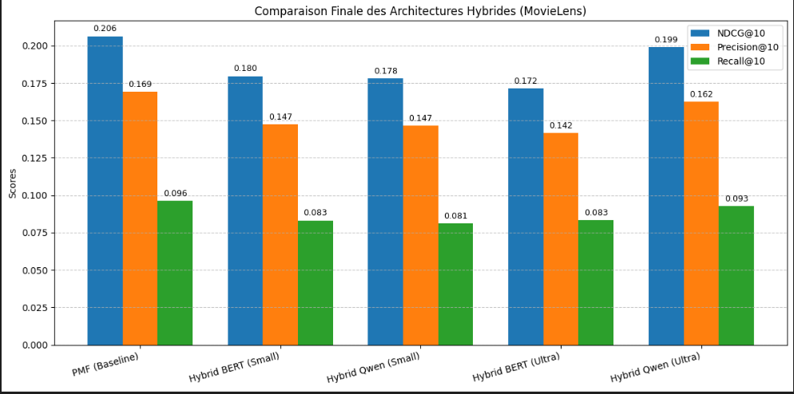

# MLSD_Projet_RecSys

# Recommandation de films avec PMF et modèles de langue (MovieLens)

# Organisation 

- Professeur : Aghiles Salah
- Etudiants : Dineshan JOSEPH FI , Sidra HYDER FI, Egxon Zejnullahi FA, Alexandre CHEN FA
- Formation : MLSD Paris Cité
- Matière : Hybrid Recommender System
- Année : 2025/2026

## Abstract

Ce travail étudie l’impact d’embeddings textuels issus de modèles de langue modernes sur la recommandation de films. Nous utilisons le jeu MovieLens sous deux formes : une version « Small » avec des descriptions courtes (titre, genres, quelques tags) et une version « Ultra » où, pour chaque film, tous les tags des utilisateurs sont concaténés en un texte plus long. Comme ligne de base, nous entraînons une factorisation matricielle probabiliste (PMF) sur les
seules interactions utilisateur–film, puis construisons des variantes hybrides intégrant des embeddings MiniLM/BERT ou Qwen gelés. Sur la version Small, ces hybrides restent proches de la
PMF, tandis que sur la version Ultra, le modèle hybride Qwen améliore NDCG@10, Precision@10 et Recall@10, ce qui montre l’intérêt de descriptions textuelles plus riches.

## Présentation

Ce projet étudie l’impact d’embeddings textuels issus de modèles de langue modernes (MiniLM/BERT et Qwen) sur la recommandation de films à partir du jeu de données MovieLens.  
Nous comparons une ligne de base de factorisation matricielle probabiliste (PMF) à plusieurs variantes « hybrides » qui combinent informations collaboratives et textuelles.

## Jeu de données

- **Source** : MovieLens *ml-latest-small* (GroupLens).
- **Interactions** : notes explicites utilisateur–film et tags libres associés aux films.
- **Deux variantes textuelles** :
  - **Small** : texte court par film (titre, genres, quelques tags).
  - **Ultra** : texte long par film obtenu en concaténant tous les tags fournis par les utilisateurs.

## Modèles

- **Baseline** :  
  - PMF entraînée uniquement sur la matrice utilisateur–film (notes).
- **Modèles hybrides** :
  - PMF + embeddings **MiniLM/BERT** (texte Small / Ultra).
  - PMF + embeddings **Qwen** (texte Small / Ultra).
- Les modèles de langue sont utilisés en mode *feature extractor* (poids gelés) et projetés dans l’espace latent via une couche linéaire.

## Métriques

Les performances sont évaluées en recommandation top‑N avec :
- **NDCG@10**
- **Precision@10**
- **Recall@10**

## Résultats (résumé)

- Sur la variante **Small**, les modèles hybrides restent proches de la PMF et n’apportent pas de gain net.
- Sur la variante **Ultra**, la configuration hybride **Qwen** améliore simultanément NDCG@10, Precision@10 et Recall@10, montrant l’intérêt de descriptions textuelles plus riches.

  

  PS: La visualisation de notre notebook ne marche pas, il faut impérativement le télécharger ! 
